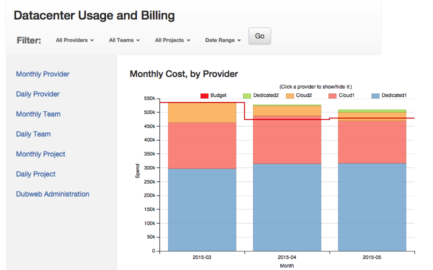
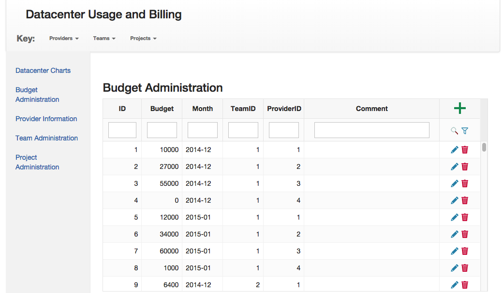

## DUBWEB - The Datacenter Usage and Billing project
Flask app, db model, and python ETL for tracking/admin of datacenter spend.
 
Example datacenter view:



Example admin view:



## Structure

### Root directory
The root directory has the WSGI file. I suggest using nginx, with uwsgi-emperor running flask app as vassals.
 
### /misc directory (Storage)
/misc has the MySQL db model for the dubwebdb.  After creating the database:
1. Populate the providers table, using one row per unique billing provider. 
2. Populate the teams table, using one row per logical team/unit.
3. Populate the projects table, assigning the team and provider to the project.  Note: projects span neither teams nor providers.
4. Populate the budgets table; assign monthly budget for each team's provider.
5. After initial provisioning, you may use the admin pages for modifying teams, projects, and budgets.

### /etl directory (Collection)
/etl has the python ETL that will pull the data as instructed by the files in the /etl/zu directory. To start collecting data:
Modify `zu_advanced_meta.json` to set DB parameters, metricstypes.
Create a metricstypes file for each separate billing provider:
1. Use the `zu_*_metrics.json` file for the specific type of billing source data given by the billing provider. e.g., Google provides json. 
2. Modify the permetric value, if desired, used in eval for providing:
  - Provider's start time (beginning of day/month metric covers).
  - Provider's project number 
  - Provider's measurement id 
  - Provider's metric measurement (e.g., 24 ) (device/hours)
  - Provider's metric untis (e.g., device/hours)
  - Provider's cost for given product described by metric.
3. Add a "various" list entry for each daily metric that needs all instance metrics for the calculation, but isn't provided by provider  (e.g., Tax):
  - Metric name
  - Provider's start time.
  - Metric id
  - Project id
  - Project name 
  - Metric formula (taxrate is passed into processing function)
  - Team id
Load the data into DUBWEB once a day by:
1. Copying the provider(s) data file(s) into the zu subdirectory.
2. Loading the data into the DB using:
`python cub_extract -f zu/zu_advanced_meta.json

### /app directory (web application)
/app has the flask app.  To personalize for your billing needs:
  1. Modify the .settings file:
    1. Move the file to a durable location accessible to uwsgi-emperor/nginx
    2. Modify the file to match your DB parameters.
    3. I suggest creating a different file for the admindb.py functionality, as the dubwebdb.py functionality only requires SELECT mysql privileges.
  2. Add a new measurement API and chart pair by:
    1. Adding data retrieval function for API to dubwebdb.py.
    2. Add API route to apis.py.
    3. Add template for new measurement/chart in templates, calling new API.
    4. Add chart route to views.py

### /tests directory (unit tests)
/tests has the python unittests. 
  1. Tests for the dubwebdb.py python module can be run using:
```
 nosetests `tests/test_dubwebdb.py`
```
  2. Tests for the admindb.by python module can be run using:
```
 nosetests `tests/test_admindb.py`
```

## Dependencies
The project uses the following applications (installed via apt-get, on Ubuntu):
* nginx

The project uses the following python packages (installed via pip)
* virtualenv
* Flask
* uwsgi
* mysql-python
* python-dateutil

